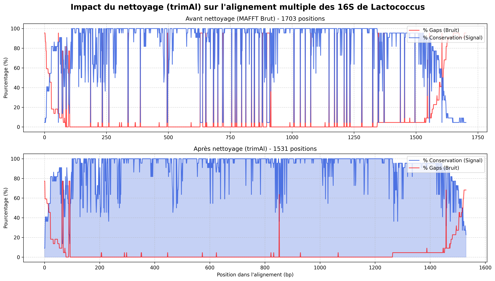
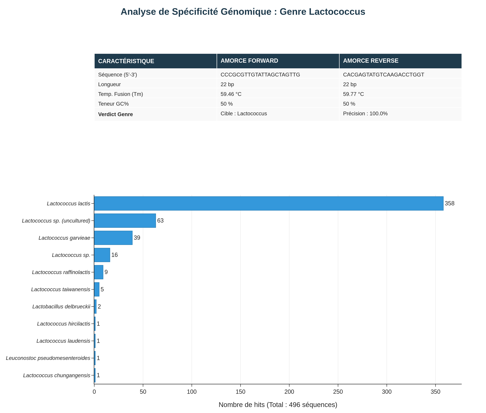

# Pipeline de design d'amorces spécifiques aux Lactococcus (16S rRNA)

## Objectif

Identifier des régions conservées dans le gène 16S rRNA de tous les *Lactococcus*,
puis vérifier que ces régions sont suffisamment différentes des genres phylogénétiquement
proches pour permettre le design d'amorces PCR spécifiques au genre *Lactococcus*.

**Genres outgroups testés :** *Lactobacillus*, *Streptococcus*, *Enterococcus*,
*Pediococcus*, *Weissella*, *Leuconostoc*

---

## Outils utilisés

| Outil      | Version | Rôle                                                        |
|------------|---------|-------------------------------------------------------------|
| vsearch    | ≥ 2.21  | Déréplication, filtre sous-séquences, détection de chimères |
| MAFFT      | ≥ 7.490 | Alignement multiple des séquences 16S                       |
| trimAl     | ≥ 1.4   | Nettoyage de l'alignement (suppression des colonnes de gaps)|
| Python 3   | ≥ 3.8   | Scoring de conservation, extraction des fenêtres candidates |
| matplotlib | ≥ 3.5   | Visualisation comparative des alignements                   |
| plotly     | ≥ 5.0   | Génération du rapport de validation SILVA                   |

**Bases de données sources :**
- RefSeq 16S : `RefSeq_16S_6-11-20_RDPv16_fullTaxo.fa.gz`
- SILVA nr99 : `silva_nr99_v138.2_toSpecies_trainset.fa.gz`

Ces deux fichiers doivent être présents dans `~/Tenebrion/data/16S/`.

---

## Structure du projet

```
~/primer_lactococcus/
├── bin/
│   ├── build_databases.sh       ← Étape 1 : constitution des bases de données
│   ├── lactococcus_align.sh     ← Étape 2 : alignement multiple MAFFT
│   ├── lactococcus_trim.sh      ← Étape 3 : trimming + validation
│   ├── compare_alignments.sh    ← Étape 4 : graphique comparatif brut/trimmé
│   ├── extract_window.sh        ← Étape 5 : scoring + extraction des fenêtres
│   ├── check_specificity.sh     ← Étape 6 : criblage de spécificité in silico
│   ├── pair_and_score.sh        ← Étape 7 : appariement F/R + scoring thermodynamique
│   ├── run_pipeline_primer.sh   ← Script maître : lance les étapes 1 à 7
│   └── plot_silva.py            ← Script autonome : génère le rapport de validation SILVA
│
├── databases/
│   ├── Lactococcus_nr.fa             ← Cible finale (≥ 1200 bp, sans chimères)
│   ├── Lactococcus_raw_extracted.fa  ← Archive pré-prétraitement
│   ├── Lactococcus_nr_chimeras.fa    ← Chimères détectées (archive)
│   ├── Lactobacillus_nr.fa           ← Outgroup (≥ 900 bp)
│   ├── Streptococcus_nr.fa
│   ├── Enterococcus_nr.fa
│   ├── Pediococcus_nr.fa
│   ├── Weissella_nr.fa
│   ├── Leuconostoc_nr.fa
│   └── outgroups_all_nr.fa           ← Tous les outgroups fusionnés
│
├── alignment/
│   ├── lactococcus_aln.fa            ← Alignement MAFFT brut (FASTA)
│   ├── lactococcus_aln.clw           ← Alignement MAFFT brut (ClustalW → Jalview/Seaview)
│   ├── mafft.log                     ← Log MAFFT
│   ├── lactococcus_aln_trimmed.fa    ← Alignement après trimAl (FASTA)
│   ├── lactococcus_aln_trimmed.clw   ← Alignement après trimAl (ClustalW)
│   ├── alignment_comparison.png      ← Graphique comparatif brut vs trimmé
│   └── conserved_windows_trimmed.fa  ← Séquences consensus FASTA → check_specificity.sh
│
└── specificity/
    ├── validated_ultra_specific_primers.tsv  ← Amorces spécifiques validées
    ├── asymmetric_pairs.tsv                  ← Toutes les paires F/R avec scores
    └── asymmetric_pairs_report.txt           ← Rapport lisible : top 20 paires
```

---

## Lancer le pipeline

```bash
# Depuis ~/primer_lactococcus/
# L'environnement conda contenant vsearch, mafft, trimal et python3 doit être activé

bash bin/run_pipeline_primer.sh
```

Le script maître exécute les 7 étapes dans l'ordre et affiche les messages
horodatés de progression. La sortie finale se trouve dans :
`specificity/asymmetric_pairs_report.txt`

---

## Détail de chaque étape

---

### Étape 1 — `build_databases.sh`

**But :** Construire les bases de données 16S non-redondantes pour la cible
(*Lactococcus*) et les 6 genres outgroups.

**Ce que fait le script :**

1. **Extraction** depuis RefSeq et SILVA de toutes les séquences contenant
   le nom du genre dans leur en-tête. Les séquences annotées uniquement au rang
   genre (sans espèce) sont conservées car elles représentent de la diversité réelle.

2. **Filtre ATCG strict** : suppression de toute séquence contenant des bases
   ambiguës (N, R, Y, W, S, M, K…), qui perturberaient l'alignement et
   fausseraient les calculs de Tm lors du criblage.

3. **Déréplication à 100% d'identité** (`vsearch --derep_fulllength`) avec
   filtre de longueur :
   - Cible *Lactococcus* : ≥ 1200 bp (séquences quasi-complètes uniquement)
   - Outgroups : ≥ 900 bp (plus permissif pour maximiser la couverture de la
     diversité lors du test de spécificité)

4. **Prétraitement spécifique de la cible** (outgroups non concernés) :
   - *Filtre des sous-séquences incluses* : supprime les séquences entièrement
     contenues dans une séquence plus longue du même jeu (artefacts de séquençage
     partiel). Réalisé via `vsearch --strand both` + script Python.
   - *Détection des chimères* (`vsearch --uchime_denovo`) : identifie et supprime
     les séquences qui semblent être la jonction artificielle de deux séquences
     biologiquement distinctes.

5. **Fusion** de tous les fichiers outgroup en un seul fichier `outgroups_all_nr.fa`,
   utilisé dans le criblage de spécificité (étape 6).

**Résultats obtenus :**

```
Lactococcus_nr.fa    :   22 séquences  (après prétraitement complet)
Lactobacillus_nr.fa  : 1320 séquences
Streptococcus_nr.fa  : 4342 séquences
Enterococcus_nr.fa   : 1298 séquences
Pediococcus_nr.fa    :  208 séquences
Weissella_nr.fa      :  268 séquences
Leuconostoc_nr.fa    :  334 séquences
outgroups_all_nr.fa  : 7770 séquences
```

> **Pourquoi seulement 22 séquences pour *Lactococcus* ?**
> Le filtre des sous-séquences a éliminé 380 séquences, car RefSeq et SILVA
> contiennent beaucoup de séquences de *Lactococcus* qui sont des versions
> tronquées ou décalées les unes des autres (même souche, séquençage partiel
> depuis des extrémités différentes). Ces 22 séquences non-redondantes et
> non-incluses couvrent l'essentiel de la diversité connue du genre.

**Fichiers produits :**
`databases/Lactococcus_nr.fa` · `databases/outgroups_all_nr.fa` · fichiers par genre

---

### Étape 2 — `lactococcus_align.sh`

**But :** Aligner les 22 séquences *Lactococcus* avec MAFFT pour produire
l'alignement multiple utilisé dans les étapes suivantes.

**Ce que fait le script :**

Alignement multiple avec MAFFT (`--auto --thread 4 --reorder`).
Deux formats de sortie sont générés :
- **FASTA** (`.fa`) : utilisé comme entrée de `lactococcus_trim.sh`
- **ClustalW** (`.clw`) : pour visualisation dans Jalview ou Seaview

**Résultats obtenus :**

```
22 séquences alignées
Longueur de l'alignement brut : 1703 colonnes
```

**Fichiers produits :**
`alignment/lactococcus_aln.fa` · `alignment/lactococcus_aln.clw` · `alignment/mafft.log`

---

### Étape 3 — `lactococcus_trim.sh`

**But :** Nettoyer l'alignement MAFFT des colonnes de gaps parasites
et valider que le nettoyage a bien amélioré le signal sans le détruire.

**Pourquoi cette étape est nécessaire :**
Même après le filtre des sous-séquences, certaines colonnes de l'alignement
contiennent de nombreux gaps car les séquences n'ont pas toutes exactement les
mêmes extrémités. Ces colonnes de bruit réduisent artificiellement les scores
de conservation et empêchent de détecter des fenêtres longues et continues.

**Ce que fait le script :**

1. **Trimming** avec trimAl (paramètre `-gt 0.20`) : supprime toutes les colonnes
   où plus de 20 % des séquences ont un gap. Deux formats de sortie : FASTA et ClustalW.

2. **Validation** : comparaison des statistiques avant/après trimming (longueur de
   l'alignement, taux de gaps moyen, distribution des colonnes propres vs gappées).

**Résultats obtenus :**

```
Avant trimming : 1703 colonnes  |  gap moyen = 0.129  |  207 colonnes gap > 50%
Après trimming : 1531 colonnes  |  gap moyen = 0.038  |   35 colonnes gap > 50%
Colonnes supprimées : 172 (10.1 % de l'alignement original)
```

**Fichiers produits :**
`alignment/lactococcus_aln_trimmed.fa` · `alignment/lactococcus_aln_trimmed.clw`

---

### Étape 4 — `compare_alignments.sh`

**But :** Générer un graphique comparatif pour vérifier visuellement que le
trimming a bien supprimé le bruit sans détruire le signal biologique.

**Ce que fait le script :**
Génère un PNG avec deux panneaux superposés (matplotlib), chacun traçant
pour chaque colonne de l'alignement le pourcentage de gaps (rouge, bruit)
et le pourcentage de conservation (bleu, signal), avant et après trimAl.

**Comment interpréter le graphique :**
- Dans le panneau **avant trimming** : des pics rouges fréquents et hauts indiquent
  les colonnes parasites qui masquaient le signal de conservation.
- Dans le panneau **après trimming** : les pics rouges doivent avoir largement
  disparu. La courbe bleue de conservation doit former des plateaux bien nets
  et plus larges, révélant clairement les régions conservées candidates.
  Si la courbe bleue s'est effondrée après trimming, c'est que le seuil `-gt`
  était trop agressif et a supprimé des colonnes biologiquement informatives.

**Fichier produit :**
`alignment/alignment_comparison.png`

**Aperçu du contrôle qualité :**

---

### Étape 5 — `extract_window.sh`

**But :** Calculer les scores de conservation sur l'alignement trimmé, puis
identifier et exporter les régions conservées candidates pour le design d'amorces.

**Ce que fait le script :**

Pour chaque colonne de l'alignement trimmé :
- Calcule le taux de conservation (fraction de séquences portant la base majoritaire)
- Calcule le taux de gaps
- Exporte ces scores en TSV et en WIG (IGV)

Ensuite, fusionne les colonnes consécutives qui respectent les deux critères
`MIN_CONS = 0.70` et `MAX_GAP = 0.05` en blocs continus appelés **fenêtres**,
et n'en retient que celles d'au moins `MIN_WINDOW = 18 bp`.
Pour chaque fenêtre, la séquence **consensus** (base majoritaire à chaque position)
est exportée en FASTA et servira à générer les amorces candidates à l'étape 6.

> **Pourquoi des seuils différents de l'étape 3 ?**
> L'étape 3 utilisait MIN_CONS = 0.90 pour un bilan intermédiaire strict.
> Ici, on abaisse à 0.70 pour élargir le pool de candidats soumis au criblage,
> en s'appuyant sur le fait que c'est le test de spécificité (étape 6) qui
> filtrera rigoureusement les amorces non spécifiques.

**Résultats obtenus :**

```
Colonnes >= 90% conservées : 1207 / 1531
Colonnes 70–90%            :  126 / 1531
Colonnes < 70%             :  198 / 1531

13 fenêtres conservées extraites
```

**Fenêtres identifiées :**

```
Fenêtre   Start    End   Longueur   Cons. moy.
W001       106     129     24 bp      0.991
W002       242     265     24 bp      0.998
W003       279     324     46 bp      0.996
W004       326     345     20 bp      0.998
W005       347     386     40 bp      0.994
W006       395     450     56 bp      0.996
W007       503     555     53 bp      0.997
W008       557     601     45 bp      0.979
W009       672     731     60 bp      0.997
W010       758     784     27 bp      0.985
W011       786     838     53 bp      0.985
W012       881    1009    129 bp      0.995
W013      1050    1124     75 bp      0.996
```

**Fichiers produits :**
`alignment/conservation_trimmed.tsv` · `alignment/conservation_trimmed.wig` ·
`alignment/conserved_windows_trimmed.tsv` · `alignment/conserved_windows_trimmed.fa` ·
`alignment/conserved_windows_trimmed.bed`

---

### Étape 6 — `check_specificity.sh`

**But :** Pour chaque fenêtre conservée, tester toutes les amorces candidates
(longueurs 18 à 22 nt, fenêtre glissante) contre la base des outgroups et
ne retenir que celles qui ne peuvent pas s'hybrider sur les genres non-cibles.

**Stratégie de validation — "3' lock" :**

Une amorce est rejetée si une séquence outgroup présente simultanément :
- ≤ 3 mismatches sur la longueur totale de l'amorce
- **0 mismatch sur les 5 derniers nucléotides en 3'**

Le critère 3' est le plus critique : c'est l'extrémité 3' qui amorce
l'ADN polymérase. Même si quelques mismatches existent en 5', une extrémité
3' parfaite suffit à permettre une extension non spécifique. Le "3' lock"
garantit qu'au moins un mismatch bloque cette extension sur tous les outgroups.

**Ce que fait le script :**
Pour chaque amorce candidate, scan exhaustif des 7770 séquences de
`outgroups_all_nr.fa`. Si un hit avec 3' lock parfait est trouvé dans un outgroup,
l'amorce est rejetée et le genre bloquant est enregistré pour le rapport.

**Résultats obtenus :**

```
Amorces testées (18 à 22 nt) : 3745
Amorces VALIDÉES              :   59
─────────────────────────────────────────────────────────────
Bloquées par Lactobacillus   : 3479  (genre le plus proche)
Bloquées par Streptococcus   :  201
Bloquées par Leuconostoc     :    6
```

> *Lactobacillus* bloque la grande majorité des candidates car c'est le genre
> phylogénétiquement le plus proche de *Lactococcus* dans la famille des
> Lactobacillaceae. Trouver 59 amorces spécifiques malgré cette proximité
> confirme que des régions discriminantes existent bien dans le gène 16S.

**Fichier produit :**
`specificity/validated_ultra_specific_primers.tsv`

---

### Étape 7 — `pair_and_score.sh`

**But :** Assembler des paires d'amorces Forward/Reverse viables et calculer
leurs propriétés physico-chimiques pour identifier les meilleures candidates.

**Stratégie asymétrique Forward × Reverse :**

| Rôle    | Source                          | Propriété                         |
|---------|---------------------------------|-----------------------------------|
| Forward | Toutes les fenêtres conservées  | Universelle pour les *Lactococcus* |
| Reverse | 59 amorces validées (étape 6)   | Ultra-spécifique au genre         |

Cette asymétrie est intentionnelle : la Forward assure une bonne couverture
de toutes les souches *Lactococcus* ; la Reverse verrouille la spécificité
de l'amplification. Le produit PCR complet est donc exclusif à *Lactococcus*.

**Critères de sélection des paires :**
- Forward positionnée en amont de la Reverse dans l'alignement
- Taille d'amplicon : 150 à 800 bp
- ΔTm ≤ 5°C (compatibilité thermodynamique pour le PCR)
- Tm entre 45 et 65°C, GC% entre 40 et 65%, pas de répétitions ≥ 4 bases identiques

**Résultats obtenus :**
58 575 paires viables identifiées, classées par ΔTm croissant.

**Fichiers produits :**
`specificity/asymmetric_pairs.tsv` · `specificity/asymmetric_pairs_report.txt`

---

## Résultats — Paires d'amorces retenues

Les trois paires suivantes ont été sélectionnées depuis le rapport et validées
via TestPrime (SILVA) et PrimerBLAST (NCBI).

---

### Paire 1 — Recommandée · Amplicon ~772 bp

Meilleur compromis taille d'amplicon / spécificité. Hits SILVA : uniquement
*Lactococcus* (931), *Pseudolactococcus* (11) et des non-cultivés (27).

```
Forward : CCCGCGTTGTATTAGCTAGTTG    22 bp   Tm = 59.46°C   GC = 50%
Reverse : CACGAGTATGTCAAGACCTGGT    22 bp   Tm = 59.77°C   GC = 50%
Amplicon estimé : ~772 bp   |   ΔTm = 0.31°C
```

| Propriété              | Forward | Reverse          |
|------------------------|---------|------------------|
| Self complementarity   | 6.00    | 5.00             |
| Self 3' comp.          | 2.00    | **5.00**         |

> ⚠ La self 3' complementarity de la Reverse (5.00) est à surveiller :
> elle peut favoriser la formation de dimères d'amorces. À vérifier avec
> IDT OligoAnalyzer ou OligoCalc avant de commander la synthèse.

---

### Paire 2 — Amplicon court · ~150 bp

Utile pour les applications qPCR ou lorsque l'ADN cible est dégradé
(métagénomique, échantillons environnementaux).

```
Forward : TGTAGGGAGCTATAAGTTCT    20 bp   Tm = 52.11°C   GC = 40%
Reverse : GAGTATGTCAAGACCTGGTA    20 bp   Tm = 53.51°C   GC = 45%
Amplicon estimé : ~150 bp   |   ΔTm = 1.40°C
```

> Tm plus basses (52–54°C) et GC% à la limite basse (40–45%) : l'efficacité
> d'amplification peut varier selon la qualité de l'ADN. À optimiser en gradient
> de température si nécessaire.

---

### Paire 3 — Haute stringence · Amplicon ~776 bp

Tm plus élevées (61–63°C) et GC% au-dessus de 50% : idéale pour des PCR
très stringentes ou pour limiter les amplifications non spécifiques résiduelles.

```
Forward : CCAAGGCGATGATACATAGCCG    22 bp   Tm = 61.25°C   GC = 54.5%
Reverse : TGTATCCCGTGTCCCGAAGGAA    22 bp   Tm = 63.13°C   GC = 54.5%
Amplicon estimé : ~776 bp   |   ΔTm = 1.88°C
```

> ΔTm de 1.88°C reste très acceptable (< 5°C). Les Tm élevées réduisent
> les risques de faux positifs mais nécessitent une polymérase adaptée
> (Taq haute fidélité) et une température d'hybridation de 58–60°C.

---

## Validation externe des amorces

Deux outils complémentaires sont à utiliser pour valider les amorces sélectionnées
avant de commander leur synthèse.

### TestPrime — SILVA
→ [https://www.arb-silva.de/search/testprime/](https://www.arb-silva.de/search/testprime/)

Tester avec 0 et 1 mismatch autorisé. Interpréter les résultats ainsi :
- **Couverture *Lactococcus*** : viser > 90%
- **Taux de faux positifs** (genres non-cibles) : viser < 5%

### PrimerBLAST — NCBI
→ [https://www.ncbi.nlm.nih.gov/tools/primer-blast/](https://www.ncbi.nlm.nih.gov/tools/primer-blast/)

Restreindre la recherche à *Lactococcus* (taxid : 1357) et vérifier qu'aucune
amplification hors-cible n'apparaît dans la base de données nr.


Pour générer le rapport graphique à partir des résultats CSV de TestPrime :

```bash
python3 bin/plot_silva.py \
    -i resultats_testprime.csv \
    -f_seq CCCGCGTTGTATTAGCTAGTTG -f_tm 59.46 -f_gc 50 -f_len 22 \
    -r_seq CACGAGTATGTCAAGACCTGGT -r_tm 59.77 -r_gc 50 -r_len 22 \
    -s 772
```

Sortie : `Rapport_Lactococcus_772bp.png`
**Aperçu du contrôle qualité :**

